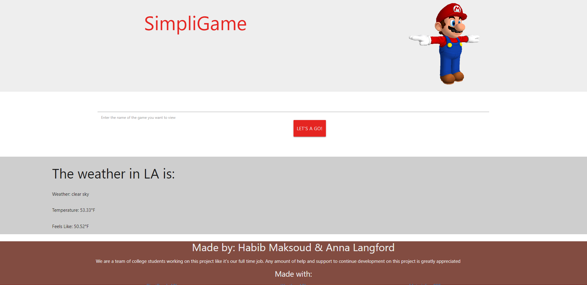

# SimpliGame

## Description

Welcome to our personalized gaming app! Our goal is to provide you with a streamlined experience by tailoring the list of video games to your search preferences. We want to help you make informed decisions about which games to play or purchase by reducing irrelevant information and simplifying the decision-making process.

Features: 
- Personalized game recommendations based on your search preferences
- Minimal reviews, descriptions, and pricing for each game
- Clean and user-friendly interface to simplify the decision-making process

---
## Table of Contents

- [Installation](#installation)
- [How it Works](#how-it-works)
- [Usage](#usage)
- [Credits](#credits)
- [License](#license)

---

## Installation

N/A

## How it Works

To get started, navigate to the [SimpliGame website](https://mynamebrogrammer.github.io/SimpliGame/). The website upon initial rendering, should look like the following screenshot: 

Then simply input your search preferences (e.g. game name) and our app will provide you with a customized list of games that match your criteria. For each game, you'll be able to see a minimal review, description, and pricing information to help you make an informed decision.
Why Use Our App

With so many video games on the market, it can be overwhelming to make a decision about which game to play or purchase. Our app solves this problem by providing you with a personalized, streamlined experience that only shows you the games that you're interested in. By reducing irrelevant information, you can make a decision more quickly and with confidence.
Conclusion

We're confident that our personalized gaming app will provide you with a unique and enjoyable experience. Whether you're a casual or hardcore gamer, our app will help you discover new games and make informed decisions about which games to play or purchase. Try it out today and see the difference for yourself!

## Credits

This app uses the [Weather API](https://openweathermap.org/current) and [Giant Bomb API](https://www.giantbomb.com/api/documentation/). 

[Habib Maksoud](https://github.com/mynamebrogrammer) and [Anna Langford](https://github.com/Anna-dxj) initially developed SimpliGame. Nick Arocho, Daniel Stark, and Anthony Barragan were consulted on road-blocks. 

## License

MIT License

Copyright (c) [2023] [Habib Maksoud & Anna Langford]

Permission is hereby granted, free of charge, to any person obtaining a copy
of this software and associated documentation files (the "Software"), to deal
in the Software without restriction, including without limitation the rights
to use, copy, modify, merge, publish, distribute, sublicense, and/or sell
copies of the Software, and to permit persons to whom the Software is
furnished to do so, subject to the following conditions:

The above copyright notice and this permission notice shall be included in all
copies or substantial portions of the Software.

THE SOFTWARE IS PROVIDED "AS IS", WITHOUT WARRANTY OF ANY KIND, EXPRESS OR
IMPLIED, INCLUDING BUT NOT LIMITED TO THE WARRANTIES OF MERCHANTABILITY,
FITNESS FOR A PARTICULAR PURPOSE AND NONINFRINGEMENT. IN NO EVENT SHALL THE
AUTHORS OR COPYRIGHT HOLDERS BE LIABLE FOR ANY CLAIM, DAMAGES OR OTHER
LIABILITY, WHETHER IN AN ACTION OF CONTRACT, TORT OR OTHERWISE, ARISING FROM,
OUT OF OR IN CONNECTION WITH THE SOFTWARE OR THE USE OR OTHER DEALINGS IN THE
SOFTWARE.